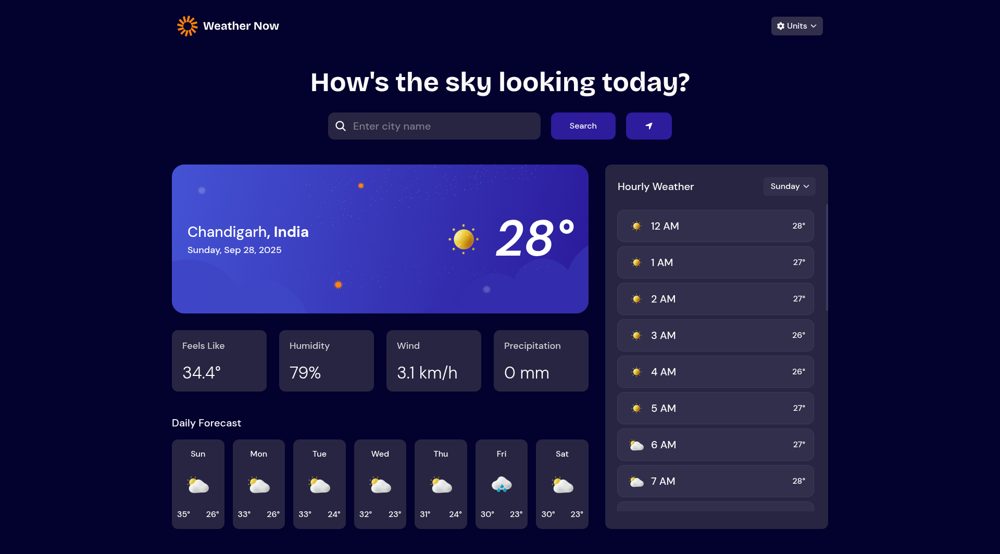
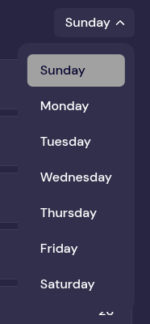

# Weather App

A modern, responsive weather application built with React that provides real-time weather information, forecasts, and location-based data. Features a sleek dark theme UI with intuitive search functionality and customizable units.

This project is based on a challenge from [Frontend Mentor](https://www.frontendmentor.io/). Special thanks to Frontend Mentor for providing the design files, images, icons, and Figma resources that made this implementation possible.

## Features

- **Real-time Weather Data**: Get current weather conditions for any location
- **Location Search**: Search for cities and locations
- **Geolocation Support**: Automatically detect and use your current location
- **Weather Forecasts**: View hourly and daily weather forecasts
- **Unit Conversion**: Toggle between metric and imperial units for temperature, wind speed, and precipitation
- **Responsive Design**: Optimized for both desktop and mobile devices
- **Dark Theme**: Modern dark UI with custom fonts and animations

## Tech Stack

- **Frontend**: React 19, React DOM
- **Styling**: Tailwind CSS 4
- **State Management**: Redux Toolkit, React Redux
- **Form Handling**: React Hook Form
- **Icons**: React Icons
- **Build Tool**: Vite
- **APIs**: Weather API, Geocoding API, Reverse Geocoding API

## Preview

### Main Previews
| Desktop Preview | Mobile Preview |
|-----------------|----------------|
|  |  |

### UI Components
| Search Bar and Hint | Unit Menu | Days Menu |
|---------------------|-----------|-----------|
|  |  |  |

## Installation

1. Clone the repository:
   ```bash
   git clone https://github.com/abhi-zero/weather-app.git
   cd weather-app
   ```

2. Install dependencies:
   ```bash
   npm install
   ```

3. Create environment variables file (`.env`) in the root directory:
   ```env
   VITE_WEATHER_API_BASE_URL=your_weather_api_base_url
   VITE_GEOCODE_API_BASE_URL=your_geocode_api_base_url
   VITE_REVERSE_GEOCODE_API_KEY=your_reverse_geocode_api_key
   VITE_REVERSE_GEOCODE_API_BASE_URL=your_reverse_geocode_api_base_url
   ```

4. Start the development server:
   ```bash
   npm run dev
   ```

5. Open your browser and navigate to `http://localhost:5173` (or the port shown in the terminal).

## Environment Variables

The application requires the following environment variables to be set in a `.env` file:

- `VITE_WEATHER_API_BASE_URL`: Base URL for the weather API
- `VITE_GEOCODE_API_BASE_URL`: Base URL for the geocoding API
- `VITE_REVERSE_GEOCODE_API_KEY`: API key for reverse geocoding
- `VITE_REVERSE_GEOCODE_API_BASE_URL`: Base URL for reverse geocoding API

## Usage

1. **Search for a Location**: Type in the search bar to find weather for any city
2. **Use Current Location**: Allow location access for automatic weather detection
3. **View Forecasts**: Scroll through hourly and daily weather predictions
4. **Change Units**: Use the unit toggle buttons to switch between metric and imperial systems

## Scripts

- `npm run dev`: Start the development server
- `npm run build`: Build the project for production
- `npm run lint`: Run ESLint for code linting
- `npm run preview`: Preview the production build locally

## Project Structure

```
src/
├── api/                 # API service functions
├── app/                 # Redux store configuration
├── assets/              # Static assets (fonts, images)
├── components/          # Reusable React components
│   ├── CurrentWeather/  # Current weather display
│   ├── DailyForecast/   # Daily forecast component
│   ├── Header/          # Navigation and header
│   ├── HourlyWeather/   # Hourly forecast
│   ├── Search/          # Location search component
│   └── WeatherDetail/   # Weather details
├── content/             # Static content
├── features/            # Redux slices
├── hooks/               # Custom React hooks
└── index.css            # Global styles and Tailwind config
```

## Future Features

- **Relocate Button**: Add a button to quickly return to the current location's weather after searching for other places. This will allow users to easily switch back to their geolocation-based weather data.

## Contributing

1. Fork the repository
2. Create a feature branch (`git checkout -b feature/amazing-feature`)
3. Commit your changes (`git commit -m 'Add some amazing feature'`)
4. Push to the branch (`git push origin feature/amazing-feature`)
5. Open a Pull Request
